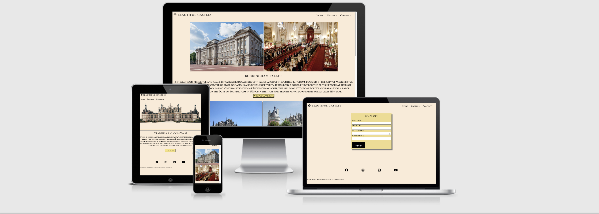
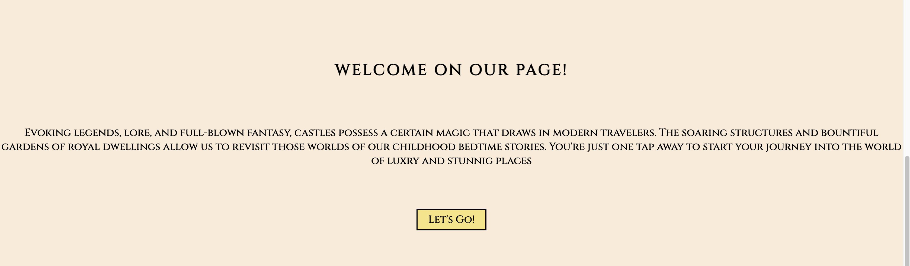
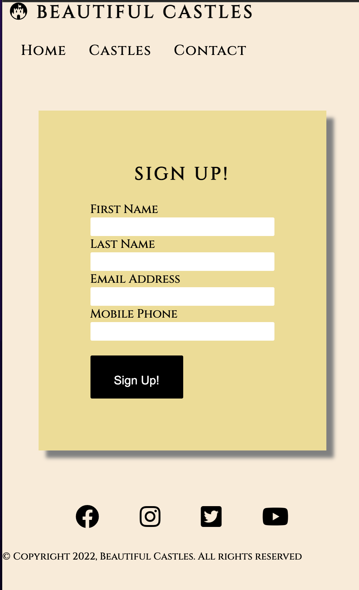
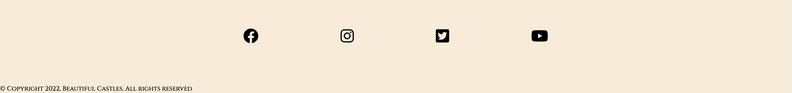
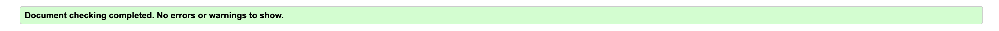
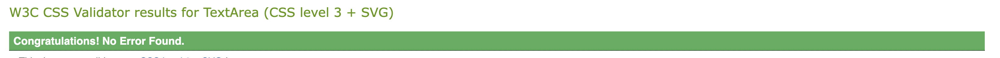
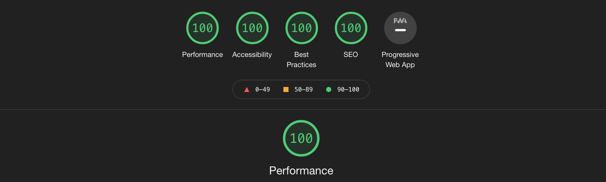
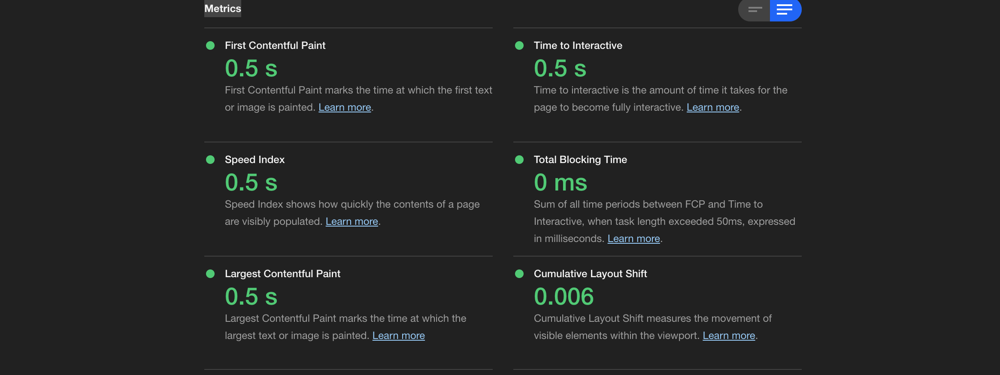

# Beautiful Castles 

Welcome to [Beautiful Castles](https://archie9010.github.io/Beautiful-Castles) A website created to give the reader a simple and direct insight into Castles. As most of them are ancient buildings, they are sometimes difficult to visit, so I hope this might be useful for anyone interested in them or just looking to read about them. This website is designed to help people find information about Castles around Europe. It has pictures and short descriptions of castles, as well as historical facts and external links to other websites for more information.

## Index 
* [Technologies Used](#technologies-used)
* [Fearures](#features)
* [Contact](#contacts)
* [Testing](#testing)
* [Deployment](#deployment)
* [Credits](#credits)

## Technologies Used

 * [HTML5](https://en.wikipedia.org/wiki/HTML5)
 * [CSS3](https://en.wikipedia.org/wiki/CSS)
 * [Git](https://en.wikipedia.org/wiki/Git) 
 * [Github](https://en.wikipedia.org/wiki/GitHub) 

## Features

### Navigation Bar

* Featured at the top of the page, The navigation shows the page name in the left corner: Beautiful Castles that links to the Home page. When hovered over Home, Castles and Contact golden underline appears for easy navigation
* Featured on all three pages, the full responsive navigation bar includes links to the Logo, Home page, Castles and Contact page and is identical on each page to allow for easy navigation.
* This section will allow the user to easily navigate from page to page across all devices without having to revert to the previous page via the ‘back’ button.

### The Page image

* This is a photo of the castle to allow the user to see what this website is about.
* This section introduces the user to Beautiful Castles with an eye-catching photo to focus their attention.

### Welcome Text

* Short descriptive text welcoming user on the page, Lets's Go button can be found underneath the text that will easily navigate the user to Castle page.

### Castles

*  In this section Users will find castles within Europe, all categorized for user convenience. User Can find castles by country, by region, or even by the name of the castle. Explore the history of each one and learn about their architecture. Castle Section is built to be interactive, informative, with colourful images to help a user make the most informed decision on future trips.

## Contact

### Sign Up Form

* Sign up is a section created for users to easily and efficiently create an account on our page also to get support and get more information regards the website. Sign up form is responsive to all screen sizes.

### Footer

* The footer section includes social media icons to users can find the website on Facebook, Instagram, Twitter and YouTube
* Copyrights text was added to the footer

## Testing

### Functionality

   
| Test Label         |            Test Action           |         Expected Outcome           | Test Outcome    |
|:------------------ |:---------------------------------|:-----------------------------------|:----------------|
| Menu Test          |  Responsive navigation bar       | Navigate to the desired page.      | PASS            |
| Website buttons    |  Responsive button               | Navigate to external websites      | PASS            |
| Sign-Up button     |  Responsive Sign-Up button       | Navigates to dump sever            | PASS            |
| Let's go button    |  Responsive Let's go button      | Navigates to gallery               | PASS            |
| Social media icons |  Responsive Social media icons   | Navigate to social media websites  | PASS            |

### Browser Compatibility

* Chrome (97) - Pass
* firefox (96) - Pass 
* Safari (15.2)- Pass 
* Edge (97) - Pass 

### Bugs

* No bugs found

### Validator Testing

* HTML
  - No errors were found when passing throught the [W3C validator](https://validator.w3.org/)

* CSS
  - No errors were found when passing through the [(Jigsaw) validator](https://jigsaw.w3.org/css-validator/)
  

* Accessibility
  - Colors and fonts chosen are easy to read and accessible by running it through lighthouse in dev tools.

### Metrics

## Deployment

### How to clone the repository

* Go to the https://github.com/Archie9010/Beautiful-Castles repository on GitHub
* Click the "Code" button to the right of the screen, click HTTPs and copy the link there
* Open a GitBash terminal and navigate to the directory where you want to locate the clone
* On the command line, type "git clone" then paste in the copied url and press the Enter key to begin the clone process

The site was deployed to GitHub pages. The steps to deploy are followed:
* Logged into GitHub
* In the GitHub repository, navigate to the Settings tab.
* From the drop-down menu, select the Main Branch
* Once the Main branch has been selected, the page provided the link to the completed website.

Live link: [Beautiful Castles](https://archie9010.github.io/Beautiful-Castles/)

## Features left to implement

* Search bar
   - Let Users Find Things Faster. A search bar allows users to find what they're looking for quickly. No matter where each user enters your site, a search bar will give them the option to find particular topics or pages fast.
* Live Chat
   - Live Chat helps you greet users pro-actively while they are going through the website using the 'auto greetings' function and it also allows them to chat with you anonymously without providing their details like email or phone.
* Blog 
   - Writing posts about topics users will find interesting and helpful. 

## Credits

* The code to build sign up form was taken from I Love Running Project
* Brian Macharia- Mentor support, guidance, tips, and key things to look out for throughout the project.

### Content

* All description text of the Castles were taken from [Wikipedia](https://en.wikipedia.org/wiki/Main_Page)
* All other content was written by the developer

### Media

* The fonts used were imported from [Google Fonts](https://fonts.google.com/)
* The icon in the header, footer were taken from [Font Awesomne](https://fontawesome.com/)
* Background Castle picture on the main page were taken from [Pexels](https://www.pexels.com/)
* All images in Castle section were downloaded from [Wikipedia](https://en.wikipedia.org/wiki/Main_Page)

### Code

* Code on how to do the shadow-box used on pictures in the gallery came from information on [W3Schools](https://www.w3schools.com/css/css3_shadows_box.asp)
* Code on how to create sig up box was based on CI Love Running Project
