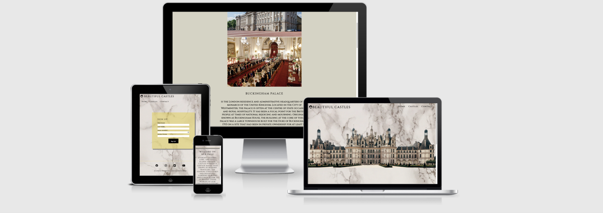
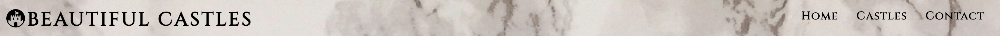

# Beautiful Castles 

Welcome to [Beautiful Castles](https://archie9010.github.io/1st-Milestone-project/) website is designed for people who are loooking for informations about Castles around Europe. Webiste contains pictures and shor description of the Castles and historical facts also I've placed reflinks to the Wikipedia under each description for mor information for potetial readers. The site will be targeted toward tourists who are looking for more information regards pleaces that they will be visiting. 

  

<h2>Features</h2>

<ul>
<li><h3>Navigation Bar</h3>
<ul>
<li>When hovererd over Home, Castles and Contact golden underline apears for easy navigation</li>
<li>Featured on all three pages, the full responsive navigation bar includes links to the Logo, Home page, Castles and Contact page and is identical in each page to allow for easy navigation.</li>
<li>This section will allow the user to easily navigate from page to page across all devices without having to revert back to the previous page via the ‘back’ button.</li></ul>
 

  

<ul>
<li><h3>The Page image</h3>
</ul>
<li>This a photo of castle to allow the user to see what this website is about.</li>
<li>This section introduces the user to Beautiful Castles with an eye catching photo to focus their attention.</li>
  

<ul>
<li><h3>Welcome Text</h3></li>
<li>

<ul>
<li><h3>Footer<h3><li>

<ul>
<h3>Castles</h3>
<li>
</ul>

<ul>
<li><h3>Contact</h3>
<li>
</ul>

<h3>Features left to implement</h3>

<h2>Testing</h2>

<h2>Validator Testing</h2>

<h2>Unfixed Bugs</h2>

<h2>Deployment</h2>

<h2>Credits</h2>

<h2>Content</h2>

<h2>Media</h2>