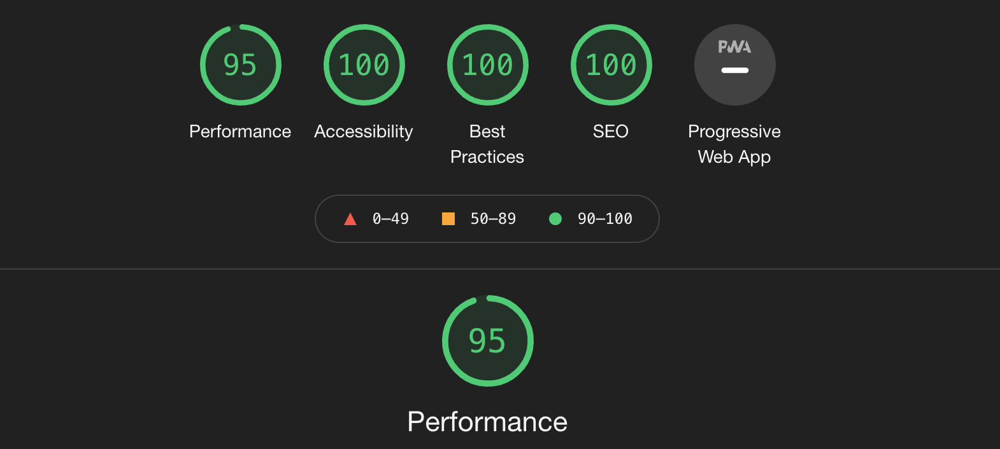

# Beautiful Castles 

Welcome to [Beautiful Castles](https://archie9010.github.io/1st-Milestone-project/) A website created with the goal of giving the reader a simple and direct insight to Castles. As most of them are ancient buildings, they are sometimes difficult to visit, so I hope this might be useful for anyone interested in them or just looking to read about them.This website is designed to help people find information about Castles around the Europe. It has pictures and short descriptions of castles, as well as historical facts and external links to other websites for more information.

  

<h2>Features</h2>

<ul>
<li><h3>Navigation Bar</h3>
<ul>
<li>Featured at the to of the page, The navigation shows the page name in the left corner: Beautiful Castles that links to the Home page. When hovererd over Home, Castles and Contact golden underline apears for easy navigation</li>
<li>Featured on all three pages, the full responsive navigation bar includes links to the Logo, Home page, Castles and Contact page and is identical in each page to allow for easy navigation.</li>
<li>This section will allow the user to easily navigate from page to page across all devices without having to revert back to the previous page via the ‘back’ button.</li></ul>
 

  

<li><h3>The Page image</h3></li>
<ul>
<li>This a photo of castle to allow the user to see what this website is about.</li>
<li>This section introduces the user to Beautiful Castles with an eye catching photo to focus their attention.</li>
</ul>
  

  

<li><h3>Welcome Text</h3>
<ul>
<li>Short descriptive text welcoming user on the page, Lets's Go button can be found unnderneath the text that will easly navigate user to Castle page.</li>
</ul>
 

  

<li><h3>Castles</h3>
<ul>
<li>In this section User will find castles within Europe, all categorized for user convenience. User Can find castles by country, by region, or even by the name of the castle. Explore the history of each one and learn about their architecture. Castle Section is built to be interactive, informative, with colorful images to help user make the most informed decision on feauture trips. 
</ul>
 

<h2>Contact</h2>

<h3>Sign Up Form</h3>
<li>Sign up is a section created for users to easily and efficiently create account on our page also to get support and get more information regards website. Sign up form is responsive to all screen sizes.
</ul>
 

 

<li><h3>Footer<h3><li>
<ul>
<li></li>
</ul>

<h2>Testing</h2>

<h3>Bugs

<h3>Validator Testing</h3>
<li>HTML</li>
<ul>
<li>No errors were found when passing throught the W3C validator</li>
</ul>
<li>Css</li>
<ul>
<li>No errors were found when passing throught the (Jigsaw) validator</li>
</ul>
<li>Accessability</li>
<ul>
<li>
</ul>

<h2>Features left to implement</h2>
